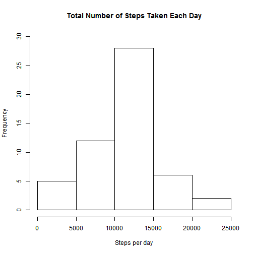

## Loading and preprocessing the data

Read in the data and if the file is still zipped, unzip it first.
Load the package 'lattice' and 'dplyr'.


```r
filename = "activity.csv"

if(!file.exists(filename)){
    zipfile <- "activity.zip"
    unzip(zipfile)
    file.remove(zipfile)          
}

data <-read.csv(filename, header = TRUE)

head(data)
```

```
##   steps       date interval
## 1    NA 2012-10-01        0
## 2    NA 2012-10-01        5
## 3    NA 2012-10-01       10
## 4    NA 2012-10-01       15
## 5    NA 2012-10-01       20
## 6    NA 2012-10-01       25
```

```r
if(!require("lattice")) 
    install.packages("lattice")

if(!require("dplyr")) 
    install.packages("dplyr")

library(lattice)
library(dplyr)
```
<br>

Preprocessing of data:
Set the time of sytstem to English format. Then, the *date* variable is converted to Date class and
a help variable *times* is created that contains the times of the interval (and the current date, which ill be ignored). This variable is helpful for the time series plots.
It is assumed that the variable *interval* saved the time in the format %H%M (24 hours), e.g.  
0 -> 00:00  
2355 -> 23:55 or 11:55 pm  


```r
Sys.setlocale("LC_TIME", "English")
```

```
## [1] "English_United States.1252"
```

```r
data$date <- as.Date(data$date,"%Y-%m-%d")

times<-unique(data$interval)
times<-sprintf("%04d",times) # add zeros, so that there are 4 numbers
times<-as.POSIXct(strptime(times, format="%H%M")) 
```
<br>


## What is mean total number of steps taken per day?  

First, the total number of steps for each day is calculated. Then, a histogram 
of the total number of steps taken each day is plotted. Afterwards, the mean and median
are computed.


```r
steps_per_date <- with(data, tapply(steps, date, sum))

hist(steps_per_date, main="Total Number of Steps Taken Each Day", 
     xlab="Steps per day", ylim= c(0, 30))
```

 

### Mean and Median

```r
mean_steps <- mean(steps_per_date, na.rm=TRUE)
median_steps <- median(steps_per_date, na.rm=TRUE)
```

The mean total number of steps taken per day is 10766 and 
the median is 10765.  
<br>
        
## What is the average daily activity pattern?

The average number of steps per interval is calculated and plotted. For the plot, the *times* variable created above will be used. The labels for the x-axis are adjusted with the parameter *scales*, so that there is a tick every 3 hours. 
Then, the maximum number of steps is calculated.


```r
mean_steps_per_interval <- with(data, aggregate(steps, list(interval = interval), mean, na.rm=TRUE))
names(mean_steps_per_interval)[2]<- "meansteps" # rename the variable containing means

xyplot(mean_steps_per_interval$meansteps~times, type="l", scales=list(x=list(
    at= seq(as.POSIXct(times[1]), by="3 hour", length=9), 
    labels=format(seq(as.POSIXct(times[1]), by="3 hour", length=9), "%H:%M"))),
    main="Average Daily Activity Pattern", xlab="Interval (as time)", ylab="Average steps")
```

 

```r
maximum <- with(mean_steps_per_interval, interval[which.max(meansteps)])
```

The interval with the identifier 835, on average across all the days in the dataset, contains the maximum number of steps, namely 206.1698113.
<br> 
<br>     

## Imputing missing values

**1. Calculation of the total number of missing values in the dataset (i.e. the total number of rows with NAs)**


```r
missing_values <- !complete.cases(data)
NAs <- sum(missing_values)
```
There are 2304 missing values in the dataset.
<br>
      
**2. A strategy for filling in all of the missing values in the dataset**  
All missing values are filled with the rounded mean for the 5-minute interval they belong to.  

For that, the average number of steps per interval is rounded. This new data frame is merged with 
the original data using the interval. The resulting data frame must be sorted the way the
original data was sorted.


```r
subdata <- round(mean_steps_per_interval)

merged_data <- merge(data, subdata, by="interval", all=TRUE)
merged_data <- arrange(merged_data, date, interval)
```
     
**3. Creation of a new data set with the missing data filled in**  
The NAs are subsetted and the extra column (column 4: meansteps) is deleted.


```r
merged_data$steps[missing_values] <- merged_data$meansteps[missing_values]
merged_data <- select(merged_data, steps, date, interval)
head(merged_data)
```

```
##   steps       date interval
## 1     2 2012-10-01        0
## 2     0 2012-10-01        5
## 3     0 2012-10-01       10
## 4     0 2012-10-01       15
## 5     0 2012-10-01       20
## 6     2 2012-10-01       25
```

**4. A histogram of the total number of steps taken each day and the calculation of the mean and median total number of steps taken per day**


```r
steps_per_date2 <- with(merged_data, tapply(steps, date, sum))

hist(steps_per_date2, main="Total Number of Steps Taken Each Day With Imputing Missing Values", 
     xlab="Steps per day", ylim= c(0, 40))
```

 

### Mean and Median

```r
mean_steps2 <- mean(steps_per_date2)
median_steps2 <- median(steps_per_date2)
```

The mean total number of steps taken per day is 10766 and 
the median is 10762. 

The two means do not differ, but the two calculated median values differ slightly. The original median has a difference of 3 steps to the second median.
<br>      
<br>  
      
## Are there differences in activity patterns between weekdays and weekends?

First, a new factor variable *week* is created in the dataset with two levels - "weekday" and "weekend" indicating whether a given date is a weekday or weekend day. Second, a panel plot is created, which  contains a time series plot of the 5-minute interval and the average number of steps taken, averaged across all weekday days or weekend days.


```r
merged_data$week <- weekdays(merged_data$date)
merged_data$week[merged_data$week=="Saturday" | merged_data$week=="Sunday" ] <- "weekend"
merged_data$week[merged_data$week!="weekend"] <- "weekday"

mean_steps_per_interval2 <- with(merged_data, aggregate(steps, list(week = week, interval=interval), mean))
# Sort the dataframe for plotting, all weekdays first
mean_steps_per_interval2 <- arrange(mean_steps_per_interval2, week, interval) 
head(mean_steps_per_interval2)
```

```
##      week interval          x
## 1 weekday        0 2.28888889
## 2 weekday        5 0.40000000
## 3 weekday       10 0.15555556
## 4 weekday       15 0.17777778
## 5 weekday       20 0.08888889
## 6 weekday       25 1.57777778
```

```r
length(mean_steps_per_interval2$x)
```

```
## [1] 576
```

```r
length(times)
```

```
## [1] 288
```

```r
# 'times' must be replicated for plotting, so that the variable has the length of mean_steps_per_interval2$x
times <- rep(times, times=2)
head(times)
```

```
## [1] "2015-01-16 00:00:00 CET" "2015-01-16 00:05:00 CET"
## [3] "2015-01-16 00:10:00 CET" "2015-01-16 00:15:00 CET"
## [5] "2015-01-16 00:20:00 CET" "2015-01-16 00:25:00 CET"
```

```r
length(times)
```

```
## [1] 576
```

```r
xyplot(x ~ times |week, data=mean_steps_per_interval2, type="l", layout=c(1,2), scales=list(x=list(
       at=seq(as.POSIXct(times[1]), by="3 hour", length=9), 
       labels=format(seq(as.POSIXct(times[1]), by="3 hour", length=9), "%H:%M"))),
       main="Activity Patterns Between Weekdays and Weekends", xlab="Interval (as time)", ylab="Number of steps")
```

 

As we can see in the plot, the activity patterns differ between weekend (Saturday and Sunday) and weekdays.
